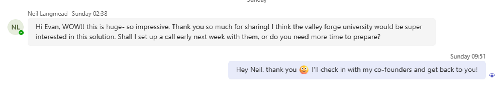

# To-do

Integrate video into website  
Deploy website onto emulate.com  
Register for interest form trial  
Share video \+ form on LinkedIn.

Families \+ video form (google forms \+ surveymonkey) \[\]

---

# Survey Methodology

Google Forms integrates with Google Sheets for direct data collection.

Methods:

- In-person: Outreach (Evan \+ Josh \+ Tim) \- visual surveys: Bath convenience stores
- SurveyMonkey: Paid \- 200 responses from families
- Sharing a website \+ video link \+ register for interest
- Direct contact: LinkedIn, Email, Phone

# Demographics \- outreach methodology

---

1. ## Parents \+ Families \+ Households (smart home)

   SurveyMonkey \- budget £500  
   Two surveys \- £250 each \- aim for 200 responses:

1. Original Video \[done\] [https://www.youtube.com/watch?v=Rhbb2dpKtTo](https://www.youtube.com/watch?v=Rhbb2dpKtTo)
1. Improved Video \[to-do\]
   Google Forms \- reach out to all our families.  
   Send on University Group Chats \- ask to forward to their parents \- answer the form.  
   Share videos to Smart Home Influencers. \[get feedback\]
   Verbal Interest in Homes

Alex’s Uncle. \[X\]  
Christian Owens.\[X\]

---

## 2\. Small businesses \- convenience stores

DONE  
Evan

Evan \+ Tim \+ Josh \- polling local business  
Wednesday. \[to-do\]

Visual Surveys \- scrappy handouts  
[https://docs.google.com/forms/u/2/d/12SbxHb6-yYtchmMRQdoUO9PiPGxdIaR2m2cm-nESCOo/edit?usp=forms_home\&ths=true\&pli=1](https://docs.google.com/forms/u/2/d/12SbxHb6-yYtchmMRQdoUO9PiPGxdIaR2m2cm-nESCOo/edit?usp=forms_home&ths=true&pli=1)

Share on local Bath business facebook chats.  
Form: [https://docs.google.com/forms/d/12SbxHb6-yYtchmMRQdoUO9PiPGxdIaR2m2cm-nESCOo/edit?pli=1](https://docs.google.com/forms/d/12SbxHb6-yYtchmMRQdoUO9PiPGxdIaR2m2cm-nESCOo/edit?pli=1)

Promotional Video

---

## 3.Care Homes \+ Assisted living \- **Interviews \+ Direct Contact**

| Name / role                                                                      | Contact                                                                                                                | Contacted \[yes/no\]              | Response |
| :------------------------------------------------------------------------------- | :--------------------------------------------------------------------------------------------------------------------- | :-------------------------------- | :------- |
| Mark Canoe Kingswood Court Management \- Care home his dad stayed in.            |                                                                                                                        | Evan Reached out to Mark Canoe \- |          |
| Pyela Chipeta General Manager General Manager Welford Healthcare Ltd · Full-time | [https://www.linkedin.com/in/pyela-chipeta-mwale-9083b77a/](https://www.linkedin.com/in/pyela-chipeta-mwale-9083b77a/) |                                   |          |
|                                                                                  |                                                                                                                        |                                   |          |
|                                                                                  |                                                                                                                        |                                   |          |

---

## 4 Suicide Prevention

Strong Interest.  
DONE  
Client Organised: HAS (30+ patrol charity)  
SP UK \- encouraged reach out.  
3 spots decided. What3words

REQUIREMENTS CONFIRMED

TO-DO  
Funding \- InnovateUK application

## ---

5\. SECOND PRIORITY: Larger Premises \- hotels, restaurants, pubs, industrial spaces, etc. Airbnbs, landlords.

Landlords, airbnbs etc:  
TODO  
Share with Louis Bollards Airbnb contact.  
Share with Luke Loveridge \- see if he would promoti

DONE  
**Neil Langmead**

DONE  
**Hotels**  
meeting with the Head of security at Hilton. (through contact with head of technology)

TODO  
Elliott \- Siemens Head.interview  
**Jake Hulme \-** Cafe he worked in back home \- analytics. \- require more info on this.  
Group \- follow up with Neil.

# Survey Outcome

Importance of each feature  
If contact has CCTV  
If they would put money on the table for it.
