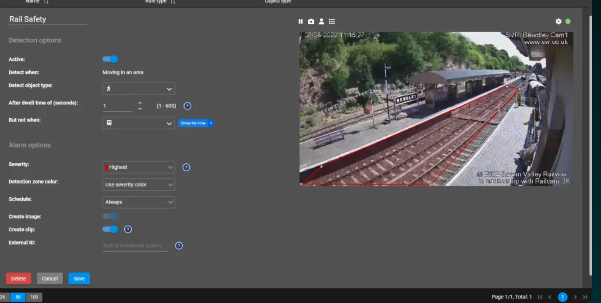

# Competitors researched

### Brief

> Competitor Features- compare the features of 3 competitor products, Ring, Arlo, Google Nest, and what we’re offering. Bonus research points for specialised accident prevention systems.

### Contents

- [Competitors researched](#competitors-researched)
  - [Brief](#brief)
  - [Contents](#contents)
  - [Names of competitors researched](#names-of-competitors-researched)
  - [General purpose competitors overview](#general-purpose-competitors-overview)
    - [Sensing features](#sensing-features)
  - [Saas competitors](#saas-competitors)
  - [Accident prevention](#accident-prevention)
  - [Our offering](#our-offering)
    - [What are we offering that is currently offered?](#what-are-we-offering-that-is-currently-offered)
    - [What are we offering that competitors don't?](#what-are-we-offering-that-competitors-dont)

---

### Names of competitors researched

| Competitor name                  | Area                                           |
| -------------------------------- | ---------------------------------------------- |
| Ring                             | Video security hardware + software (Amazon)    |
| Arlo                             | Video security hardware + software             |
| Nest                             | Video security hardware + software(Google)     |
| Eufy                             | Video security hardware + software             |
| Wyze                             | Video security hardware + software (ex-Amazon) |
| Genetec Inc                      | Video SAAS                                     |
| Kinesense                        | Video SAAS                                     |
| Caliber Interconnects' KENVISION | Video SAAS                                     |
| Iris+                            | Accident prevention                            |

## General purpose competitors overview

### Sensing features

- Nest, Arlo, Ring, Eufy all offer alerts, based off motion sensing, this is not that useful to our goal, of providing custom alerts
- However, some offer more granular alerts, as shown in the table

|      | Sound detection | Familar faces | Specific alerts (e.g. vehicle,package) | AI search                                          |
| ---- | --------------- | ------------- | -------------------------------------- | -------------------------------------------------- |
| Ring | X               | X             | X (Person, package, vehicle)           | X (You can search for events containing a red car) |
| Arlo |                 |               | X (Person, package, vehicle)           |                                                    |
| Nest | X               | X             | X (Person, package, vehicle)           |                                                    |
| Eufy |                 |               | X (Person, pet)                        |                                                    |
| Wyze |                 |               | X (Person pet)                         |                                                    |

- These aren't really competitors
  - They are providing hardware and software
  - But alerting solutions are limited to did something happen with a human in this box
  - Ring gets the closest with it's AI search technology
  - This poses a potential challenge, they have the technology to translate nlp -> matching alerts
  - So they could probably quite easily add an alerting feature to this, however they don't do this at the moment

## Saas competitors

- Genetec
  - Integrates all of your existing video hardware
  - Allows for AI search, e.g. a red car within the last two hours
  - But you can't search for **anything**
  - Has alarms, but not based on this AI search
- Kinesense,
  - More of an enterprise level solution
  - Allows for searching through lots of CCTV data, but retrospectively
  - Does not provide alerting as far as I can see
- **KENVISION**
  - This does provide alerting for critical events
  - As well as NLP for alerts
  - It also integrates into a currently existing system
  - I couldn't find a demo, but there system seems to be super similar to what we're offering based on what was on their website
- Verkada
  - Offers ai search
- Kenvision gets the closest out of these to a competitor, from their website it seems they are offering a solution very similar to ours. However, I can't find a demo, so we would have to do more research to confirm this.

## Accident prevention

- Iris+ fall detection

  - Offers fall detection from video cameras, based of dection
  - It also provides a lot of other features, I couldn't see if it uses NLP to do anything, but it does have
    - Loitering
    - Crowd counting
    - Anomaly detection
    - Search for similar
    - Perimter detection
    - Facial recognition
    - etc...
  - So this does seem to be quite similar to what we're offering, as it does offer lots of alerts:
    

    <video controls src="vnnu4m.mp4" title="Title"></video>
    Source (https://irisity.com/iris-platform-overview/ai-fall-detection)

- Others I could find focusing on accident prevention

  - SafelyYou
  - KamiCare
  - Pentegra systems
  - FallCall solutions

- Focusing in on our idea of looking at accident prevention instead of other uses (e.g. shoplifting) there are already a lot of competitors in this space
  - lots of systems that allow for fall detection
  - And one system that includes fall detection amongst lots of other features

## Our offering

- We plan on translating NLP instructions -> video alerts
- And sending these alerts over whatsapp
- We had suggested that this could be useful to do in the care space, however, reserach has confirmed this is a crowded market
- The only solution I could find that can take any NLP instruction to an alert is Kenvision

### What are we offering that is currently offered?

- TODO

### What are we offering that competitors don't?

- TODO
