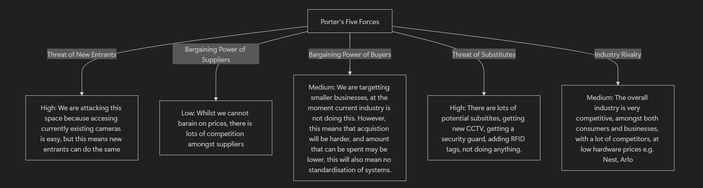
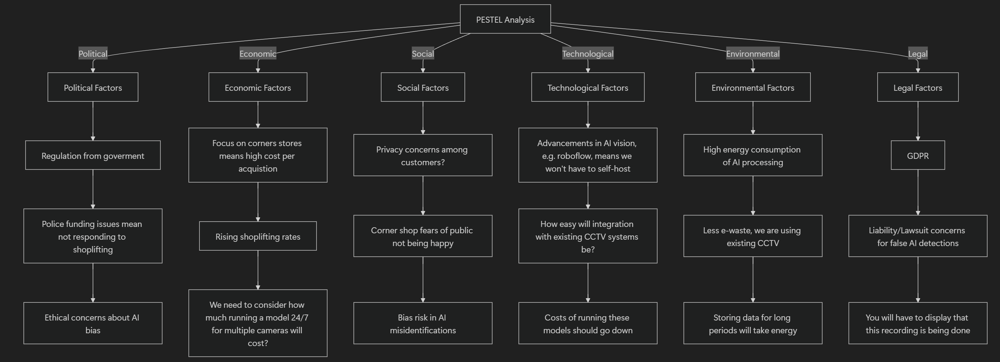
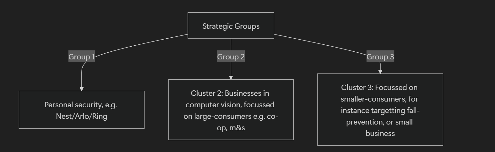

# Sector analysis

## Industry

### Five forces

### Pestel

### Strategic group analysis

- Group 3 has the lowest competition
- However, there are low mobility barriers between groups, Nest could easily market itself as a syste, for smaller consumers
